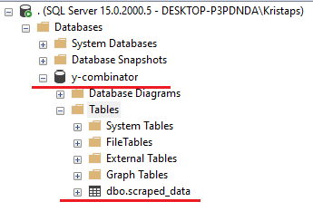
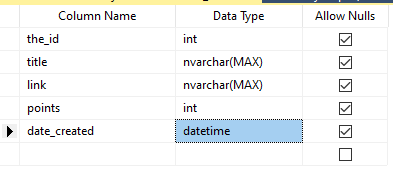
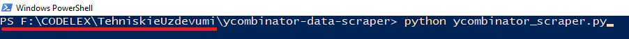
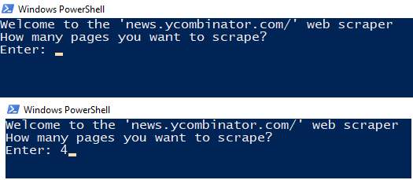
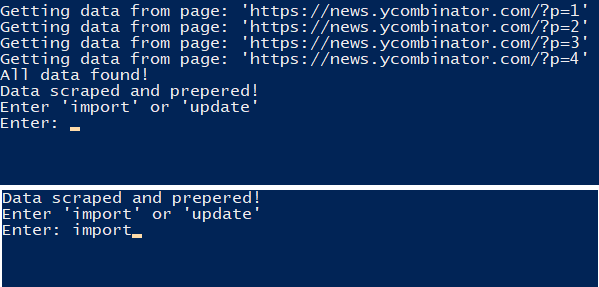
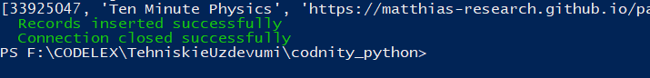
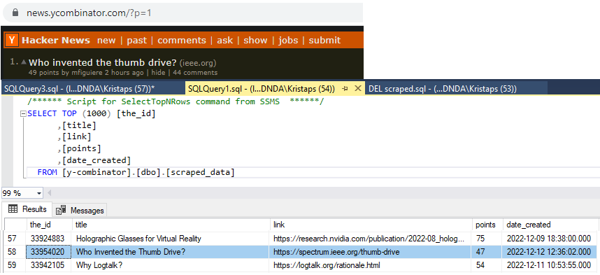
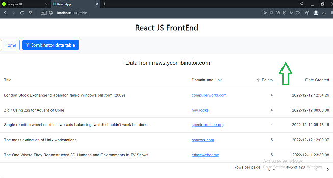

1. Open your Microsoft SQL Server Management Studio (SQLSMS)

2. Create new database named 'y-combinator'

3. Create new Table in (SQLSMS) named 'scraped_data'

<table>
  <tr>
    <th>Example</th>
    <th>Picture 1</th> 
    <th>Picture 2</th>    
  </tr>
  <tr>
    <td>

    the_id : int,
    title : nvarchar(MAX),
    link : nvarchar(MAX),
    points : int,
    created_date : datetime

  </td>
    <td></td>   
    <td></td> 
  </tr>
</table>

4. Go to  
   ...\ycombinator-data-scraper
   open cmd or powershell type 'python ycombinator_scraper.py'
   absolute path will be different than mine, but if you cloned repository locally, then 'ycombinator-data-scraper' should be the same as mine. And press enter. :smiley:

5. Python script will start to run and it will ask for input. Enter reasonable amount!

6. Python will ask you second question. If it's first time enter 'import'. But it's second time and you want to update 'points'. Enter 'update'. You can also enter 'import' two times in row. It will not add duplicate data. But add new one to existing.

7. After import is complete. You will see message in green text.

8. Now you can auto generate SQL query or write it your selft to see if data has imported successfully!

9. Go to ...\ycombinator-data-scraper\UserInterface\react-ui  
   open cmd or powershell type 'npm install' and then 'npm start'

10. Go To ...\ycombinator-data-scraper\API\ycombinator\ycombinator  
    open cmd or powershell type 'dotnet watch run'

11. Now all data is added to database. You can see it using 2 options:

- 1
  Go To  
  https://localhost:7191/swagger/index.html
  And you can test C# backend

- 2
  Go To  
  http://localhost:3000
  To see front end example

Press 'Table' button to see all data we scraped from website (https://news.ycombinator.com)
You can sort data by <b>title</b> and <b>points</b>! You can try 'Dense padding' button below the 'Table' and also pick how many 'Rows per page' page will be shown.

12. Now that you can see all the data. You can try to import aditional data using Python script. Or update your data. Make sure you pick same page amount like in first time! Got to step <b>6.</b> and try 'update' !

## If you have trouble launching project. See information below.
### :exclamation::exclamation: Download and install:exclamation::exclamation:

Microsoft SQL Server Management Studio  
https://learn.microsoft.com/en-us/sql/ssms/download-sql-server-management-studio-ssms?view=sql-server-ver16

SQL Server  
https://www.microsoft.com/en-us/sql-server/sql-server-downloads

Node Js Latest LTS Version 
https://nodejs.org/en/download/

Python  
https://www.python.org/downloads/

:exclamation::exclamation::exclamation:Do not forget to download and install Python libraries!

- ['Requests' - Home page](https://requests.readthedocs.io/en/latest/)
- ['Requests' - Installation](https://requests.readthedocs.io/en/latest/user/install/#install)

- ['Beautiful Soup' - Documentation](https://www.crummy.com/software/BeautifulSoup/bs4/doc/)
- ['Beautiful Soup' - Installation](https://www.crummy.com/software/BeautifulSoup/bs4/doc/#installing-beautiful-soup)

- ['pypyodbc' - GitHub page and Installation](https://github.com/pypyodbc/pypyodbc)

.NET 6.0  
https://dotnet.microsoft.com/en-us/download
