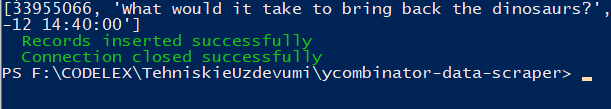
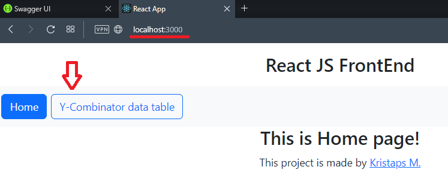

### Download

Microsoft SQL Server Management Studio  
https://learn.microsoft.com/en-us/sql/ssms/download-sql-server-management-studio-ssms?view=sql-server-ver16

SQL Server  
https://www.microsoft.com/en-us/sql-server/sql-server-downloads

Python  
https://www.python.org/downloads/

.NET 6.0  
https://dotnet.microsoft.com/en-us/download

 

1. Open your Microsoft SQL Server Management Studio (SQLSMS)

2. Create new database named 'y-combinator'

3. Create new Table in (SQLSMS) named 'scraped_data'

<table>
  <tr>
    <th>Example</th>
    <th>Picture 1</th> 
    <th>Picture 2</th>    
  </tr>
  <tr>
    <td>

    the_id : int,
    title : nvarchar(MAX),
    link : nvarchar(MAX),
    points : int,
    created_date : datetime

  </td>
    <td></td>   
    <td></td> 
  </tr>
</table>

4. Go to  
   ...\codnity_python
   open cmd or powershell type 'python ycombinator_scraper.py'
   absolute path will be different than mine, but if you cloned repository locally, then 'codnity_python' should be the same as mine. And press enter. :smile:
   

5. Python script will start to run and it will ask for input. Enter reasonable amount!
   

6. Python will ask you second question. If it's first time enter 'import'. But it's second time and you want to update 'points'. Enter 'update'. You can also enter 'import' two times in row. It will not add duplicate data. But add new one to existing.
   

7. After import is complete. You will see message in green text.
   

8. Now you can auto generate SQL query or write it your selft to see if data has imported successfully!
   

9. Go to ...\codnity_python\UserInterface\react-ui  
open cmd or powershell type 'npm install' and then 'npm start'

10. Go To ...\codnity_python\API\ycombinator\ycombinator  
open cmd or powershell type 'dotnet watch run'

11. Now all data is added to database. You can see it using 2 options:

- 1 
Go To  
https://localhost:7191/swagger/index.html
And you can test C# backend

- 2
Go To  
http://localhost:3000
To see front end example

Press 'Table' button to see all data we scraped from website (https://news.ycombinator.com)
You can sort data by <b>title</b> and <b>points</b>!
